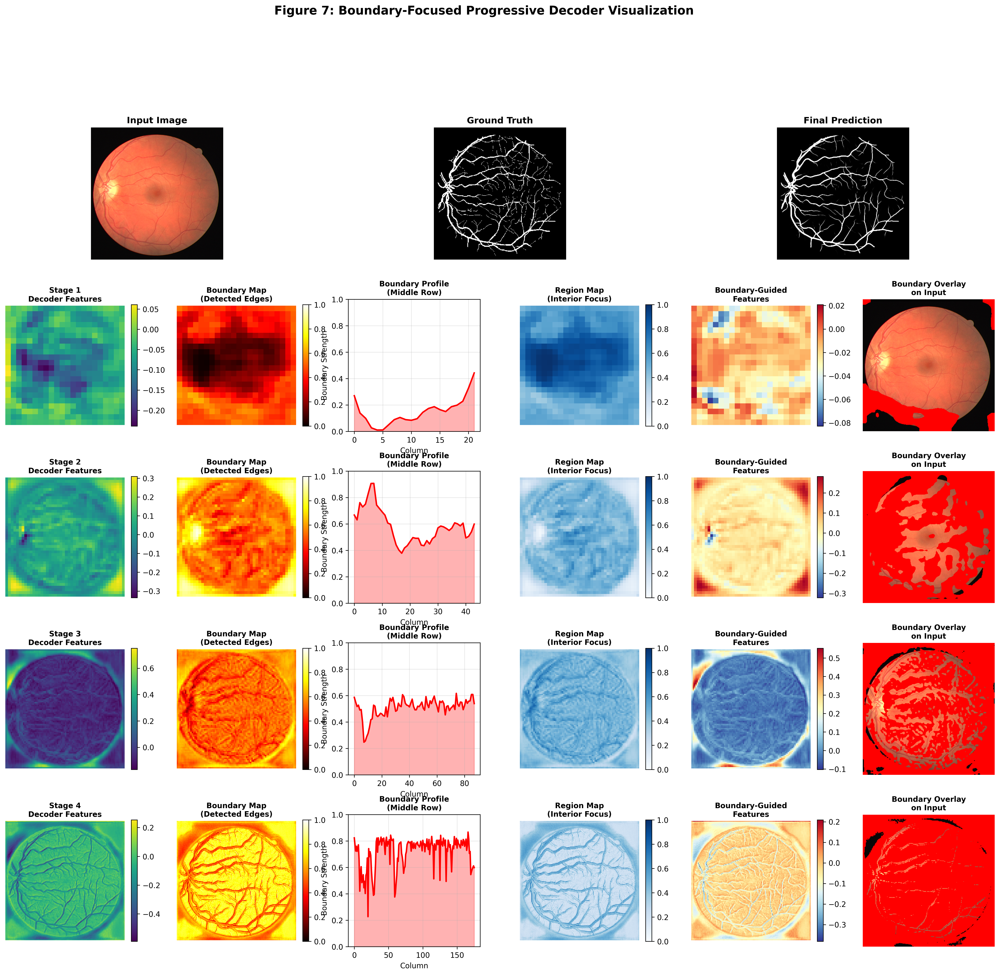
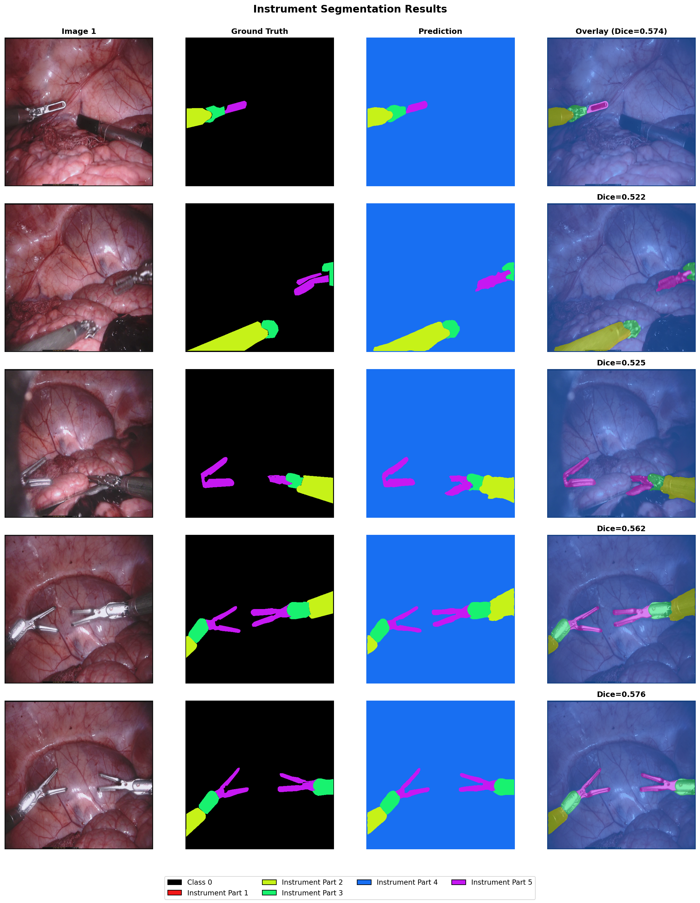
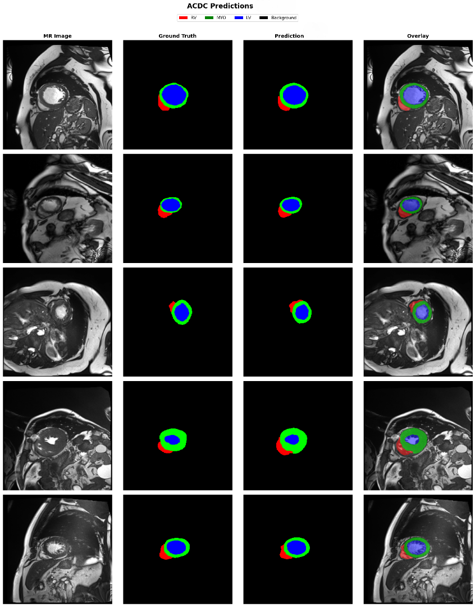
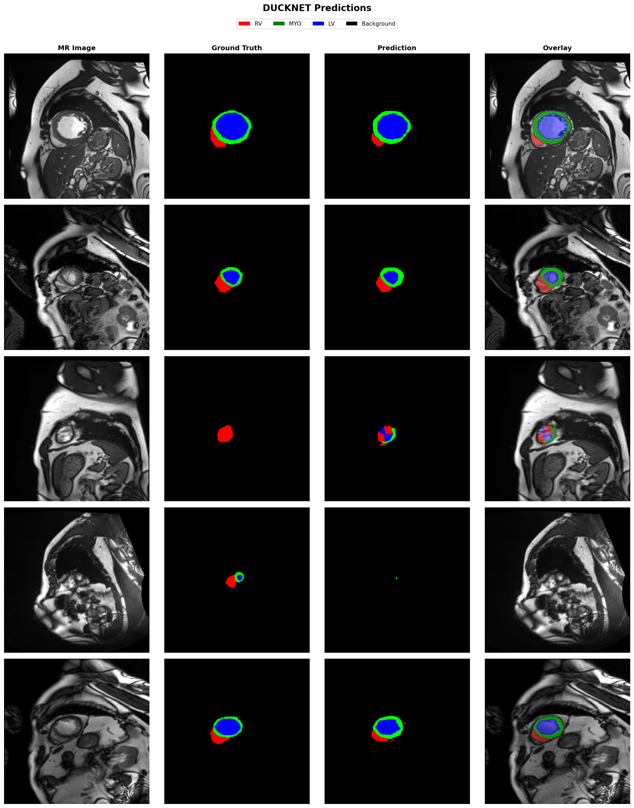
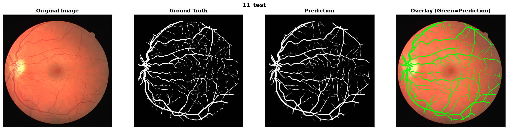

# S2M-Net: Spectral-Spatial Mixing with Morphology-Aware Adaptive Loss for Medical Image Segmentation

<p align="center">
  <em>Proceedings of the 43rd International Conference on Machine Learning (ICML 2026), Seoul, South Korea</em>
</p>

<p align="center">
  <strong>Sanaullah Chowdhury</strong> · <strong>Lameya Sabrin</strong><br/>
  Independent Researchers, Dhaka, Bangladesh<br/>
  <a href="mailto:sanaullahashfat@gmail.com">sanaullahashfat@gmail.com</a><br/>
  <a href="mailto:slameya.work@gmail.com">slameya.work@gmail.com</a>
</p>

---

## Abstract

Medical image segmentation requires balancing global context with computational efficiency, where self-attention mechanisms suffer from quadratic O((HW)²C) complexity. We propose **S2M-Net**, a parameter-efficient architecture **(4.7M parameters)** that achieves computational savings through **Spectral–Spatial Token Mixing (SSTM)**. SSTM achieves O(HWC²) complexity through efficient combination of O(HWC log(HW)) frequency-domain processing and O(HWCd) bottlenecked spatial gating (d=16), exploiting spectral concentration where **>93% of energy** is captured by K=32 low-frequency components (~0.8% of the spectrum at 352×352 resolution).

To handle geometric diversity, we introduce **Morphology-Aware Adaptive Segmentation Loss (MASL)**, which automatically modulates five loss objectives based on per-sample morphological descriptors (tubularity, compactness, irregularity, and scale).

Evaluation across **15 datasets spanning 8 modalities** demonstrates:
- **Best performance on 14 of 15 datasets**
- Statistically significant improvements (p < 0.0033, Bonferroni-corrected) on **7 challenging tasks**
- **83.43% Dice** on EndoVis17 multiclass (+8.69% over TransUNet, +9.14% over UMamba) using **12.8× fewer parameters** (4.7M vs. 60M)

---

## Architecture Overview

<p align="center">
  
</p>

> **Figure 2.** S2M-Net encoder–decoder framework with multi-scale feature extraction, a bridge stage, and a Boundary-Focused Decoder (BFD) with skip connections. Bottom: MRF-SE block for local multi-scale context modeling, SSTM block for efficient global mixing via spectral-domain gating, and BFD decoder block for region–boundary feature fusion and segmentation refinement.

S2M-Net is a **five-stage encoder–decoder** architecture. Each encoder stage integrates:
1. **MRF-SE** — Multi-Receptive-Field Squeeze-and-Excitation blocks for local feature extraction
2. **SSTM** — Spectral-Selective Token Mixing for global information exchange
3. **BFD** — Boundary-Focused Decoder stages with soft spatial routing
4. **MASL** — Morphology-Aware Adaptive Segmentation Loss for adaptive supervision

---

## Network Architecture Details

### Encoder–Decoder Configuration (Table 9)

| Path | Stage | Resolution | Filters | Stride | MRF-SE | SSTM |
|------|-------|-----------|---------|--------|--------|------|
| | Stem | 352² → 352² | 16 | 1 | – | – |
| Encoder | Stage 1 | 352² → 176² | 24 | 2 | ✓ | ✓ |
| Encoder | Stage 2 | 176² → 88² | 32 | 2 | ✓ | ✓ |
| Encoder | Stage 3 | 88² → 44² | 64 | 2 | ✓ | ✓ |
| Encoder | Stage 4 | 44² → 22² | 80 | 2 | ✓ | ✓ |
| Encoder | Stage 5 | 22² → 11² | 128 | 2 | ✓ | ✓ |
| Decoder | Stage 5→4 | 11² → 22² | 80 | – | BFD block | |
| Decoder | Stage 4→3 | 22² → 44² | 64 | – | BFD block | |
| Decoder | Stage 3→2 | 44² → 88² | 32 | – | BFD block | |
| Decoder | Stage 2→1 | 88² → 176² | 24 | – | BFD block | |
| | Head | 176² → 352² | C | – | 1×1 conv + sigmoid | |

### Parameter Breakdown (Table 10)

| Component | Parameters | % of Total |
|-----------|-----------|-----------|
| **Encoder (72.6%)** | **3.41M** | |
| Stem | 0.14M | 3.0% |
| Stage 1 (MRF-SE + SSTM) | 0.48M | 10.2% |
| Stage 2 (MRF-SE + SSTM) | 0.62M | 13.2% |
| Stage 3 (MRF-SE + SSTM) | 0.81M | 17.2% |
| Stage 4 (MRF-SE + SSTM) | 0.75M | 16.0% |
| Stage 5 (MRF-SE + SSTM) | 0.61M | 13.0% |
| **Decoder (26.4%)** | **1.24M** | |
| BFD Stage 5→4 | 0.42M | 8.9% |
| BFD Stage 4→3 | 0.35M | 7.4% |
| BFD Stage 3→2 | 0.28M | 6.0% |
| BFD Stage 2→1 | 0.19M | 4.1% |
| **Segmentation Head (1.0%)** | **0.05M** | |
| 1×1 Conv + Upsampling | 0.05M | 1.0% |
| **Total** | **4.70M** | **100%** |

### Computational Breakdown (Table 8)

| Component | FLOPs (G) | % |
|-----------|-----------|---|
| MRF-SE (5 stages) | 5.8 | 51.8% |
| SSTM Spectral | 2.7 | 24.1% |
| SSTM Spatial | 1.8 | 16.1% |
| BFD Decoder | 0.9 | 8.0% |
| **Total** | **11.2** | **100%** |

---

## Novel Components

### 1. Spectral-Selective Token Mixer (SSTM)

SSTM replaces quadratic self-attention with dual-branch processing:

**Spectral branch** — per-channel 2D FFT, truncate to central K×K coefficients (K=32), apply learnable filtering, inverse FFT:

```
X = FFT2D(x)  →  X_crop = CropK(fftshift(X))  →  X̃_crop = X_crop ⊙ W_spec  →  x_spec = Re(IFFT2D(...))
```

**Spatial branch** — content-gated channel mixing with bottleneck dimension d=16:

```
g = σ(sWg + bg),   x_gate = Reshape(ELU((s ⊙ g)WB)WC, (H, W, C))
```

**Fusion** — residual connection:

```
x̃ = x + Dropout(LN(Conv1×1([x_spec ‖ x_gate])), p=0.1)
```

**Complexity:** O(HWC log(HW) + HWC²) vs. self-attention's O((HW)²C).

### 2. Multi-Receptive-Field Squeeze-and-Excitation Block (MRF-SE)

Parallel multi-scale local feature extraction:

1. **Channel expansion** — pointwise conv, expand by ratio r=6
2. **Parallel depthwise convolutions** — kernels {3×3, 5×5, 7×7}
3. **Multi-scale fusion** — concatenate + fuse back
4. **SE channel attention** — GAP → FC → Sigmoid
5. **Residual projection** — project back to input channels

### 3. Boundary-Focused Decoder (BFD)

At each decoder stage m, soft spatial routing combines region and boundary streams:

```
z(m) = r(m) ⊙ (1 - β(m)) + b(m) ⊙ β(m)
```

where β(m) ∈ [0,1] is a learned boundary probability map — interior regions (β≈0) use smooth region features; boundary regions (β≈1) use sharpened edge features. β is learned through backpropagation from MASL's boundary loss without explicit edge annotations (Table 7 shows Spearman ρ = 0.68–0.82 correlation with ground-truth edges).

<p align="center">
  
</p>

### 4. Morphology-Aware Adaptive Segmentation Loss (MASL)

MASL combines five differentiable loss components with dual adaptation:

```
L_MASL(y, p; w) = Σᵢ wᵢ αᵢ(y) Lᵢ(y, p) / (Σᵢ wᵢ αᵢ(y) + ε)
```

| Component | Formula | Role |
|-----------|---------|------|
| L_core | 0.4·L_Dice + 0.3·L_IoU + 0.3·L_wBCE | Robust spatial overlap |
| L_bnd | Multi-scale gradient alignment at scales {1,2,4} | Fine boundary alignment |
| L_str | Compactness difference |κ(y) − κ(p)| | Geometric plausibility |
| L_sca | Focal loss with adaptive γ ∈ {3.0, 2.0, 1.5} | Small structure emphasis |
| L_tex | Second-order gradient difference | Smooth interior / texture |

**Morphological modulation functions** (computed from GT mask per batch):

| Factor | Formula | Drives |
|--------|---------|--------|
| α_core | 1 + 0.5 · c(y) | Emphasizes compact structures |
| α_bnd | 1 + 1.5 · τ(y) + c(y) | Emphasizes tubular/thin structures |
| α_str | 1 + τ(y) | Emphasizes structural regularity |
| α_sca | 1 + 1.5 · ι(y) | Emphasizes irregular boundaries |
| α_tex | 1 + ι(y) | Emphasizes boundary complexity |

Where τ(y) = tubularity, c(y) = compactness, ι(y) = irregularity, s(y) = relative size.

**Learned weight specialization** across tasks:
- Polyps → w_bnd → 2.31
- Vessels → w_str → 2.18
- Tumors → w_sca → 2.07

---

## Main Results

### Table 1: Comparison Across 15 Datasets (Dice %, mean ± std over 5 runs)

All methods retrained under identical optimization. MASL applied to all baselines to isolate architectural effects.  
†: statistically significant (p < 0.0033, Bonferroni-corrected). S2M-Net: 4.7M params (12.8× fewer than TransUNet).

| Dataset | U-Net | U-Net++ | PraNet | Swin-Unet | TransUNet | UMamba | DuckNet | RAPUNet | **S2M-Net** |
|---------|-------|---------|--------|-----------|-----------|--------|---------|---------|-------------|
| **Polyp Segmentation (Endoscopy)** |
| Kvasir-SEG | 90.64±0.41 | 91.81±0.53 | 93.03±0.38 | 93.22±0.44 | 93.75±0.36 | 92.40±0.47 | 94.11±0.33 | 93.12±0.45 | **96.05±0.28**† |
| CVC-ClinicDB | 92.18±0.38 | 92.70±0.42 | 92.65±0.44 | 92.52±0.61 | 87.28±0.52 | 90.09±0.48 | 93.89±0.54 | 95.10±0.38 | **95.65±0.31**† |
| CVC-ColonDB | 88.12±0.56 | 88.98±0.49 | **92.78±0.37** | 91.45±0.43 | 90.33±0.47 | 86.62±0.58 | 92.69±0.39 | 91.85±0.52 | 90.69±0.52 |
| ETIS-LaribDB | 91.22±0.44 | 89.80±0.51 | 93.46±0.35 | 94.10±0.33 | 94.43±0.31 | 91.23±0.46 | 94.98±0.29 | 94.23±0.41 | **96.12±0.30** |
| **Dermoscopy (Skin Lesions)** |
| ISIC-2018 | 86.93±0.48 | 87.51±0.45 | 89.05±0.39 | 89.43±0.42 | 87.12±0.47 | 89.23±0.38 | 90.10±0.43 | 89.45±0.31 | **91.09±0.36** |
| PH2 | 88.34±0.52 | 89.83±0.46 | 91.52±0.38 | 92.66±0.35 | 93.56±0.39 | 90.12±0.44 | 90.34±0.43 | 92.15±0.49 | **96.67±0.32**† |
| **Histopathology & Ultrasound** |
| GlaS | 91.57±0.39 | 91.40±0.41 | 90.40±0.46 | 89.01±0.53 | 89.92±0.48 | 91.18±0.42 | 88.73±0.55 | 91.67±0.07 | **93.83±0.38** |
| BUSI | 76.77±0.61 | 78.35±0.56 | 79.48±0.52 | 82.52±0.49 | 82.11±0.51 | 79.04±0.58 | 78.13±0.63 | 81.34±0.73 | **85.07±0.45**† |
| **Surgical Robotics (EndoVis-2017)** |
| Binary | 95.93±0.26 | 95.32±0.29 | 95.24±0.30 | 95.24±0.30 | 95.45±0.28 | 95.53±0.27 | 95.11±0.31 | 95.78±0.36 | **95.95±0.28** |
| Multiclass | 61.07±1.12 | 70.93±0.89 | 73.86±0.76 | 73.22±0.78 | 74.74±0.72 | 74.29±0.75 | 73.88±0.87 | 74.81±0.19 | **83.43±0.63**† |
| **Brain Tumor MRI** |
| BraTS2020 | 65.67±0.84 | 66.05±0.82 | 66.44±0.81 | 69.86±0.73 | 68.36±0.77 | 62.88±0.91 | 66.93±0.79 | 67.82±0.12 | **79.96±0.58**† |
| **Cardiac MRI** |
| ACDC | 89.52±0.42 | 90.15±0.45 | 91.11±0.38 | 92.32±0.37 | 92.44±0.36 | 91.57±0.48 | 92.13±0.38 | 91.45±0.20 | **93.09±0.43** |
| **Retinal Vessel Segmentation** |
| STARE | 81.18±0.54 | 81.73±0.51 | 82.94±0.47 | 83.86±0.44 | 83.10±0.46 | 82.05±0.58 | 81.41±0.62 | 82.34±0.38 | **84.45±0.48** |
| DRIVE | 79.02±0.56 | 80.18±0.59 | 81.94±0.49 | 83.07±0.48 | 81.45±0.50 | 82.18±0.58 | 81.39±0.57 | 82.94±0.12 | **84.06±0.49** |
| CHASE-DB | 81.51±0.52 | 81.65±0.51 | 81.47±0.52 | 83.12±0.49 | 82.93±0.47 | 82.90±0.59 | 83.16±0.58 | 83.21±0.29 | **84.95±0.48** |
| **Average** | 83.98 | 85.09 | 86.29 | 87.04 | 86.46 | 85.42 | 86.47 | 86.72 | **90.07** |
| **Model Params** | 31.0M | 26.1M | 32.5M | 27.0M | 60.0M | 60.0M | 11.8M | – | **4.7M** |

### Table 2: Architecture vs. MASL Disentanglement (Dice %)

| Method | Loss | Kvasir | DRIVE | EV17-MC | BraTS20 | Avg |
|--------|------|--------|-------|---------|---------|-----|
| TransUNet | Dice+CE | 92.17 | 80.92 | 71.83 | 66.42 | 77.84 |
| Swin-Unet | Dice+CE | 91.84 | 82.14 | 70.54 | 67.91 | 78.11 |
| S2M-Net | Dice+CE | 93.89 | 82.74 | 78.91 | 74.83 | 82.59 |
| **S2M-Net** | **MASL** | **96.05** | **84.06** | **83.43** | **79.96** | **85.88** |
| Arch. gain (S2M vs. best@Dice+CE) | | +1.72 | +0.60 | +7.08 | +6.92 | **+4.48** |
| MASL gain (MASL vs. Dice+CE) | | +2.16 | +1.32 | +4.52 | +5.13 | **+3.29** |

### Multiclass Per-Class Results (Table 15)

#### EndoVis-2017 Multiclass (3-Part Instrument Segmentation)

| Class | U-Net | U-Net++ | PraNet | Swin-Unet | TransUNet | UMamba | DuckNet | **S2M-Net** | Improvement |
|-------|-------|---------|--------|-----------|-----------|--------|---------|-------------|-------------|
| Shaft | 72.4 | 82.1 | 85.3 | 84.7 | 86.2 | 85.9 | 85.1 | **89.7** | +3.5 |
| Wrist | 64.8 | 75.2 | 79.8 | 79.1 | 81.3 | 80.8 | 80.2 | **85.2** | +3.9 |
| Clasper (Jaw) | 46.0 | 55.4 | 56.5 | 55.9 | 56.7 | 56.1 | 56.3 | **75.4** | **+18.7** |
| **Mean Dice** | 61.07 | 70.90 | 73.87 | 73.23 | 74.73 | 74.27 | 73.87 | **83.43** | **+8.70** |

<p align="center">
  
</p>

#### BraTS2020 (3 Tumor Regions)

| Class | U-Net | U-Net++ | PraNet | Swin-Unet | TransUNet | UMamba | DuckNet | **S2M-Net** | Improvement |
|-------|-------|---------|--------|-----------|-----------|--------|---------|-------------|-------------|
| Enhancing Tumor (ET) | 71.3 | 72.1 | 72.8 | 76.4 | 74.6 | 68.9 | 73.2 | **84.2** | +7.8 |
| Tumor Core (TC) | 67.2 | 68.4 | 69.1 | 72.8 | 71.2 | 65.4 | 69.8 | **81.3** | +8.5 |
| Whole Tumor (WT) | 58.5 | 57.6 | 57.4 | 60.4 | 59.3 | 54.3 | 57.8 | **74.4** | **+14.0** |
| **Mean Dice** | 65.67 | 66.03 | 66.43 | 69.87 | 68.37 | 62.87 | 66.93 | **79.97** | **+10.10** |

#### ACDC Cardiac MRI (3 Structures)

| Structure | U-Net | U-Net++ | PraNet | Swin-Unet | TransUNet | UMamba | DuckNet | **S2M-Net** |
|-----------|-------|---------|--------|-----------|-----------|--------|---------|-------------|
| Left Ventricle (LV) | 94.2 | 94.8 | 95.3 | 96.1 | 96.3 | 95.7 | 96.2 | 95.7 |
| Myocardium (MYO) | 88.4 | 89.2 | 90.5 | 91.8 | 91.9 | 90.9 | 91.4 | **92.1** |
| Right Ventricle (RV) | 86.0 | 86.5 | 87.5 | 89.1 | 89.1 | 88.1 | 88.8 | **91.5** |
| **Mean Dice** | 89.53 | 90.17 | 91.10 | 92.33 | 92.43 | 91.57 | 92.13 | **93.10** |

<p align="center">
  
</p>

> **Figure 3.** Qualitative results on the ACDC cardiac MRI dataset. Our method yields smoother contours and improved boundary alignment versus U-Net, TransUNet, and RAPUNet.

---

## Ablation Studies (Table 3)

Systematic component removal on four representative datasets: Dice coefficient (%).

| Configuration | Kvasir | DRIVE | GlaS | PH2 |
|--------------|--------|-------|------|-----|
| **Full Model (Ours)** | **96.05** | **84.06** | **93.83** | **96.67** |
| **MASL Loss Components** | | | | |
| w/o Core Loss | 92.31 | 81.12 | 77.32 | 93.82 |
| w/o Boundary Loss | 87.96 | 80.45 | 90.85 | 89.91 |
| w/o Structure Loss | 94.42 | 82.67 | 90.17 | 93.88 |
| w/o Scale-Aware Focal | 95.15 | 83.21 | 90.43 | 94.56 |
| w/o Texture Loss | 95.68 | 83.04 | 88.67 | 94.01 |
| **Adaptive Mechanisms** | | | | |
| Fixed Weights | 88.92 | 78.34 | 90.38 | 91.45 |
| No Morphology Modulation | 89.37 | 79.78 | 90.28 | 91.92 |
| **SSTM Frequency Truncation** | | | | |
| K=16 | 89.87 | 80.92 | 88.57 | 92.34 |
| K=24 | 93.56 | 82.45 | 90.43 | 93.98 |
| K=32 **(optimal)** | **96.05** | **84.06** | **93.83** | **96.67** |
| K=48 | 95.98 | 83.71 | 89.89 | 93.38 |
| K=64 | 95.75 | 83.52 | 90.42 | 93.11 |
| **Architecture Modules** | | | | |
| w/o SSTM | 88.45 | 77.78 | 86.92 | 90.67 |
| w/o BFD Decoder | 89.87 | 79.89 | 88.34 | 92.28 |
| w/o MRF-SE | 89.23 | 78.45 | 87.56 | 91.78 |
| Vanilla U-Net Baseline | 85.67 | 74.34 | 86.48 | 88.45 |

Key findings:
- Removing **SSTM**: −4.6 to −7.6% Dice (average −6.70% across four datasets)
- Removing **BFD**: −3.8 to −6.2% Dice (average −5.06%)
- Removing **MRF-SE**: −4.0 to −6.8% Dice (average −5.90%)
- **No morphology modulation**: −6.68% on Kvasir; **fixed weights**: −7.13% on Kvasir

---

## Spectral Energy Analysis

### Spectral Energy Retention Across Modalities (Table 4)

K=32 retains **94.8% average energy** while representing only **0.83%** of frequency coefficients at 352×352.

| Modality | K=16 | K=24 | K=32 | K=48 |
|----------|------|------|------|------|
| Colonoscopy | 89.3±2.1% | 93.7±1.4% | 95.2±1.2% | 97.1±0.9% |
| Fundus | 91.2±1.8% | 94.8±1.2% | 96.4±0.9% | 97.8±0.7% |
| Brain/Cardiac MRI | 87.6±2.4% | 92.1±1.6% | 94.1±1.3% | 96.2±1.0% |
| Ultrasound | 85.9±3.2% | 90.8±2.1% | 93.3±1.7% | 95.4±1.3% |
| **Average** | **88.5±2.4%** | **92.9±1.6%** | **94.8±1.3%** | **96.6±1.0%** |

<p align="center">
  
</p>

### Segmentation Quality Under Truncation (Table 5)

Mean Dice degradation at K=32 vs. full-resolution FFT: **0.24%** across structures.

| Dataset | Structure | K=32 | Full | Δ |
|---------|-----------|------|------|---|
| DRIVE | Thin vessels (<3px) | 83.6±0.8 | 83.9±0.9 | −0.3% |
| DRIVE | Medium vessels | 86.7±0.5 | 86.9±0.6 | −0.2% |
| Kvasir | Small polyps | 95.1±0.9 | 95.3±1.0 | −0.2% |
| Kvasir | Medium polyps | 96.9±0.5 | 97.0±0.6 | −0.1% |
| EndoVis17 | Instrument tips | 82.3±1.4 | 82.7±1.5 | −0.4% |

### Boundary Preservation (Table 6)

95th percentile Hausdorff Distance (pixels). K=32 introduces only **0.1–0.2 pixel** boundary error.

| Dataset | K=32 | Full | Δ |
|---------|------|------|---|
| Kvasir-SEG | 7.8±1.3 | 7.6±1.4 | +0.2px |
| DRIVE | 2.7±0.4 | 2.6±0.4 | +0.1px |
| EndoVis17 | 5.9±1.2 | 5.7±1.3 | +0.2px |

<p align="center">
  
</p>

---

## Computational Efficiency

### Full Efficiency Comparison (Table 18)

All methods on NVIDIA Tesla P100 16GB, batch size 8, resolution 352×352, 100 test images from Kvasir-SEG.

| Method | Params (M) | FLOPs (G) | GPU Mem (GB) | Inference (ms) | Training (hrs) | Throughput (img/s) | Dice (%) |
|--------|-----------|-----------|-------------|----------------|----------------|-------------------|---------|
| U-Net | 31.0 | 54.3 | 3.2 | 12.4±0.3 | 8.2 | 80.6 | 90.64 |
| U-Net++ | 26.1 | 48.7 | 3.8 | 14.1±0.4 | 9.1 | 70.9 | 91.81 |
| PraNet | 32.5 | 38.9 | 3.5 | 15.8±0.5 | 7.8 | 63.3 | 93.03 |
| DuckNet | 11.8 | 28.4 | 2.6 | 11.2±0.3 | 6.9 | 89.3 | 94.11 |
| TransUNet | 60.0 | 45.2 | 5.9 | 42.3±1.2 | 18.5 | 23.6 | 93.75 |
| Swin-Unet | 27.0 | 38.4 | 4.7 | 35.8±0.9 | 15.3 | 27.9 | 93.22 |
| UMamba | 60.0 | 31.6 | 4.2 | 28.7±0.8 | 12.4 | 34.8 | 92.40 |
| **S2M-Net** | **4.7** | **11.2** | **1.8** | **10.1±0.2** | **6.5** | **99.0** | **96.05** |
| vs. TransUNet | **12.8×** fewer | **4.0×** fewer | **3.3×** fewer | **4.2×** faster | **2.8×** faster | **4.2×** higher | **+2.30%** |

### Resolution Scaling (Table 19)

TransUNet OOM at 768×768; S2M-Net scales near-linearly.

| Resolution | S2M-Net (ms) | TransUNet (ms) | S2M-Net Mem (GB) | TU Mem (GB) |
|-----------|-------------|----------------|-----------------|-------------|
| 256×256 | 6.8 | 28.1 | 1.2 | 4.1 |
| 352×352 | 10.1 | 42.3 | 1.8 | 5.9 |
| 512×512 | 18.7 | 112.4 | 3.1 | 14.2 |
| 768×768 | 38.2 | **OOM** | 5.8 | >16 |
| Scaling | ~linear | super-linear | – | – |

### Training Efficiency (Table 20)

All methods: Adam, cosine annealing, batch size 16, NVIDIA Tesla P100 16GB.

| Method | Training Time (hrs) | Epochs to Converge | Peak Mem (GB) | Final Dice (%) |
|--------|--------------------|--------------------|--------------|---------------|
| U-Net | 8.2 | 102 | 3.2 | 90.64 |
| TransUNet | 18.5 | 127 | 5.9 | 93.75 |
| Swin-Unet | 15.3 | 118 | 4.7 | 93.22 |
| UMamba | 12.4 | 95 | 4.2 | 92.40 |
| **S2M-Net** | **6.5** | **81** | **1.8** | **96.05** |

### Comparison with Larger Specialized Models (Table 14)

| Method | Params (M) | FLOPs (G) | DRIVE | ClinicDB | EndoVis17 | GlaS | PH2 | ACDC | Average |
|--------|-----------|-----------|-------|---------|-----------|------|-----|------|---------|
| nnU-Net | 30.8 | 52.1 | 82.34 | 90.67 | 78.43 | 88.76 | 91.45 | 90.12 | 86.96 |
| VM-UNet | 44.2 | 41.3 | 83.21 | 91.02 | 79.12 | 89.34 | 91.78 | 90.54 | 87.50 |
| MedNeXt | 22.5 | 33.7 | 83.45 | 91.23 | 79.87 | 89.67 | 92.01 | 90.89 | 87.85 |
| **S2M-Net** | **4.7** | **11.2** | **84.06** | **95.65** | **95.95** | **93.83** | **96.67** | **93.09** | **93.21** |

---

## Qualitative Results

<p align="center">
  
</p>

> GlaS histopathology gland segmentation.

<p align="center">
  
</p>

<p align="center">
  
</p>

---

## Repository Structure

```
S2M-Net/
├── s2mnet/
│   ├── __init__.py
│   ├── models/
│   │   ├── __init__.py
│   │   ├── s2mnet.py          # Full S2M-Net model
│   │   ├── blocks.py          # SSTM, MRF-SE, BFD (standalone blocks)
│   │   └── baselines.py       # UNet, UNet++, TransUNet, UMamba, etc.
│   ├── losses/
│   │   ├── __init__.py
│   │   ├── mal.py             # Morphology-Aware Adaptive Loss (standalone)
│   │   └── components.py      # Individual loss components
│   ├── dataloaders/
│   │   ├── __init__.py
│   │   ├── base.py            # Base dataset class
│   │   ├── patch_dataset.py   # Patch-based dataset (retinal, etc.)
│   │   ├── full_image.py      # Full-image dataset
│   │   └── augmentations.py   # All augmentation pipelines
│   └── utils/
│       ├── __init__.py
│       ├── metrics.py         # Dice, IoU, Precision, Recall
│       ├── preprocessing.py   # CLAHE, FOV masking, normalization
│       ├── spectral.py        # Spectral analysis utilities
│       └── visualization.py   # Prediction visualization helpers
├── configs/
│   ├── default.yaml           # Base configuration
│   ├── retinal.yaml           # Retinal vessel segmentation
│   ├── polyp.yaml             # Polyp segmentation
│   └── surgical.yaml          # Surgical instrument segmentation
├── experiments/
│   └── ablation_configs.py    # 23 ablation study configurations
├── scripts/
│   └── analyze_spectral.py    # Standalone spectral analysis script
├── train.py                   # Training entry point
├── test.py                    # Evaluation entry point
└── requirements.txt
```

---

## Quick Start

### Installation

```bash
git clone https://github.com/your-username/S2M-Net.git
cd S2M-Net
pip install -r requirements.txt
```

### Training

```bash
# Polyp segmentation (full-image)
python train.py --config configs/polyp.yaml

# Retinal vessel segmentation (patch-based)
python train.py --config configs/retinal.yaml

# Surgical instrument segmentation
python train.py --config configs/surgical.yaml

# Override any config value from CLI
python train.py --config configs/retinal.yaml \
    training.epochs=150 \
    training.batch_size=8 \
    model.sstm_k=32
```

### Evaluation with TTA

```bash
python test.py --config configs/polyp.yaml \
    --checkpoint runs/polyp/best_model.h5 \
    --tta
```

### Ablation Studies

```bash
# List all 23 ablation configurations
python experiments/ablation_configs.py --list

# Run specific ablations
python train.py --config configs/polyp.yaml --ablation 0   # Full model
python train.py --config configs/polyp.yaml --ablation 7   # No morphology modulation
python train.py --config configs/polyp.yaml --ablation 15  # No SSTM
python train.py --config configs/polyp.yaml --ablation 21  # Vanilla U-Net baseline
python train.py --config configs/polyp.yaml --ablation 22  # Simple Dice loss
```

---

## Using Components Independently

Every module is designed to be imported and used standalone.

### Full S2M-Net Model

```python
from s2mnet.models import S2MNet

model = S2MNet(
    input_size=352,
    num_classes=1,          # 1 for binary, N for multi-class
    filters=[24, 32, 64, 80, 128],
    use_mrfse=True,
    use_sstm=True,
    use_bfp=True,
    sstm_k=32,
)
model.summary()
```

### SSTM — Spectral-Selective Token Mixer

```python
from s2mnet.models.blocks import SpectralSelectiveTokenMixer

# Global mixing at O(HWC log(HW) + HWC²) instead of O((HW)²C)
sstm = SpectralSelectiveTokenMixer(
    channels=64,
    num_frequencies=32,    # K=32 retains >93% spectral energy
    ssm_state_dim=16,      # bottleneck dimension d
    use_spectral=True,
    use_ssm=True,
    dropout=0.1,
)
# x: (B, H, W, C) → out: (B, H, W, C)
out = sstm(x)
```

### MRF-SE — Multi-Receptive Field Block

```python
from s2mnet.models.blocks import MRF_SE_Block

mrfse = MRF_SE_Block(
    filters=64,
    kernels=[3, 5, 7],      # parallel depthwise convolutions
    se_reduction=16,
    expand_ratio=6,
)
out = mrfse(x)              # shape: (B, H, W, 64)
```

### BFD — Boundary-Focused Decoder Stage

```python
from s2mnet.models.blocks import BFP_DecoderStage

bfp = BFP_DecoderStage(
    filters=64,
    routing='soft',  # 'soft' | 'hard' | 'learned' | 'none'
)
out, boundary_map = bfp(decoder_input, skip_features)
# out:          (B, H, W, 64)  — fused features
# boundary_map: (B, H, W, 1)   — learned boundary probability β
```

### MASL — Morphology-Aware Adaptive Loss

```python
from s2mnet.losses import MorphologyAwareLoss

# Full MASL with all 5 components
loss_fn = MorphologyAwareLoss(
    components=['core', 'boundary', 'structure', 'scale', 'texture'],
    learned_weights=True,
    morphology_modulation=True,
)
model.compile(optimizer='adam', loss=loss_fn)

# After training — inspect learned component weights
weights = loss_fn.get_learned_weights()
# e.g. {'core': 1.12, 'boundary': 2.31, 'structure': 1.84, ...}

# Ablation variants
loss_core_only = MorphologyAwareLoss(components=['core', 'boundary'])
loss_fixed     = MorphologyAwareLoss(learned_weights=False)
loss_no_morph  = MorphologyAwareLoss(morphology_modulation=False)

# Individual loss components
from s2mnet.losses.components import CoreLoss, BoundaryLoss, ScaleAwareFocalLoss, TextureLoss

core     = CoreLoss()        # 0.4·Dice + 0.3·IoU + 0.3·wBCE
boundary = BoundaryLoss(scales=[1, 2, 4])
focal    = ScaleAwareFocalLoss()   # adaptive γ ∈ {1.5, 2.0, 3.0}
texture  = TextureLoss()
```

### Dataloaders

```python
from s2mnet.dataloaders import PatchDataset, FullImageDataset

# Patch-based (retinal: DRIVE, CHASE-DB, STARE)
train_dataset = PatchDataset(
    data_dir='data/CHASE-DB/train',
    patch_size=256,
    stride=32,
    min_fg_ratio=0.005,
    augment=True,
    use_clahe=True,
    use_fov_mask=True,
)

# Full-image (polyps, surgical, dermoscopy, etc.)
train_dataset = FullImageDataset(
    data_dir='data/Kvasir-SEG/train',
    input_size=352,
    augment=True,
    expansion_factor=30,   # virtual epoch expansion for small datasets
)
```

### Metrics

```python
from s2mnet.utils.metrics import dice_coefficient, iou_score, precision_metric, recall_metric
```

---

## Supported Datasets

| Dataset | Modality | Task | Loader |
|---------|----------|------|--------|
| Kvasir-SEG | Endoscopy | Polyp segmentation | `FullImageDataset` |
| CVC-ClinicDB | Endoscopy | Polyp segmentation | `FullImageDataset` |
| CVC-ColonDB | Endoscopy | Polyp segmentation | `FullImageDataset` |
| ETIS-LaribPolypDB | Endoscopy | Polyp segmentation | `FullImageDataset` |
| ISIC-2018 | Dermoscopy | Skin lesion | `FullImageDataset` |
| PH2 | Dermoscopy | Skin lesion | `FullImageDataset` |
| BUSI | Ultrasound | Breast tumor | `FullImageDataset` |
| GlaS | Histopathology | Gland segmentation | `FullImageDataset` |
| BraTS2020 | Brain MRI (2.5D) | Tumor segmentation (3-class) | `FullImageDataset` |
| ACDC | Cardiac MRI | Cardiac structure (3-class) | `FullImageDataset` |
| EndoVis-2017 | Surgical endoscopy | Instrument (binary + 3-class) | `FullImageDataset` |
| DRIVE | Fundus | Retinal vessel | `PatchDataset` |
| CHASE-DB | Fundus | Retinal vessel | `PatchDataset` |
| STARE | Fundus | Retinal vessel | `PatchDataset` |

---

## Hyperparameters

### Training Configuration (Table 12)

| Parameter | Value |
|-----------|-------|
| Optimizer | Adam (β₁=0.9, β₂=0.999, ε=10⁻⁸) |
| Initial learning rate | 1×10⁻⁴ |
| LR schedule | Cosine annealing + 10-epoch warmup |
| Min learning rate | 1×10⁻⁶ |
| Batch size | 8 per GPU (32 effective, 4 GPUs) |
| Training epochs | 150 |
| Early stopping | 50 epochs patience |
| Gradient clipping | 1.0 |
| Weight decay | 1×10⁻⁴ |
| Hardware | 4× NVIDIA Tesla P100 16GB |
| Seeds (5 runs) | {42, 123, 456, 789, 2024} |

### Component Hyperparameters (Table 11)

| Component | Parameter | Value |
|-----------|-----------|-------|
| MRF-SE | Kernel sizes | {3, 5, 7} |
| MRF-SE | Expansion ratio r | 6 |
| MRF-SE | SE reduction | 16 |
| MRF-SE | Dropout | 0.1 |
| SSTM | Truncation K | 32 |
| SSTM | Bottleneck d | 16 |
| SSTM | Dropout | 0.1 |
| BFD | Boundary kernel | 5 |
| MASL | Initial w_core, w_bnd, w_str | 1.0 |
| MASL | Initial w_scale, w_tex | 0.5 |
| MASL | Weight range | [0.1, 10.0] |

---

## Ablation Study Index

23 pre-configured experiments:

| ID | Name | Description |
|----|------|-------------|
| 0 | FULL_MODEL | Full S2M-Net + Complete MAL (5 components + morphology) |
| **MAL Component Ablations** |
| 1 | MAL_NO_CORE | MAL without Core Loss |
| 2 | MAL_NO_BOUNDARY | MAL without Boundary Loss |
| 3 | MAL_NO_STRUCTURE | MAL without Structure Loss |
| 4 | MAL_NO_SCALE | MAL without Scale-Aware Focal Loss |
| 5 | MAL_NO_TEXTURE | MAL without Texture Loss |
| **MAL Adaptation Mechanisms** |
| 6 | MAL_FIXED_WEIGHTS | Full MAL, but fixed (non-learned) weights |
| 7 | MAL_NO_MORPHOLOGY | Full MAL, but no morphology modulation (α_i=1) |
| **SSTM Truncation Size K** |
| 8 | SSTM_K16 | SSTM K=16 |
| 9 | SSTM_K24 | SSTM K=24 |
| 10 | SSTM_K48 | SSTM K=48 |
| 11 | SSTM_K64 | SSTM K=64 |
| **SSTM Stage Placement** |
| 12 | SSTM_EARLY_ONLY | SSTM at stages 1–2 only |
| 13 | SSTM_MIDDLE_ONLY | SSTM at stage 3 only |
| 14 | SSTM_LATE_ONLY | SSTM at stages 4–5 only |
| 15 | NO_SSTM | No SSTM at any stage |
| **BFP Routing Variants** |
| 16 | BFP_HARD | BFP with hard routing (threshold=0.5) |
| 17 | BFP_NO_ROUTING | BFP without routing (concatenate only) |
| 18 | BFP_LEARNED | BFP with learned routing weights |
| 19 | NO_BFP | Standard upsample+cat decoder (no BFD) |
| **Architecture Components** |
| 20 | NO_MRFSE | No MRF-SE blocks |
| 21 | VANILLA_UNET | Vanilla U-Net (no MRF-SE, SSTM, or BFD) |
| 22 | SIMPLE_DICE | Full architecture + simple Dice loss only |

---
## Citation

If you find this repository useful, please cite our paper:

bibtex
@inproceedings{chowdhury2026s2mnet,
  title     = {{S2M-Net}: Spectral-Spatial Mixing with Morphology-Aware Adaptive Loss for Medical Image Segmentation},
  author    = {Chowdhury, Sanaullah and Sabrin, Lameya},
  booktitle = {Proceedings of the 43rd International Conference on Machine Learning},
  year      = {2026},
  url       = {https://openreview.net/forum?id=eh48NIgu9z}
}

## License

MIT License


## Acknowledgements

The authors thank the anonymous reviewers whose detailed feedback substantially improved this work, and the open-source medical imaging community for releasing the 15 benchmark datasets used in this evaluation.

> **Impact Statement.** S2M-Net targets resource-constrained clinical deployment. At 4.7M parameters and 11.2 GFLOPs, it is deployable on standard clinical workstations where transformer-based models (>27M parameters, >38 GFLOPs) cannot operate, potentially broadening access to AI-assisted medical image analysis in lower-resource healthcare settings. Automated segmentation outputs should not replace radiologist or clinician judgment; clinical validation and regulatory approval are required before any clinical use.
